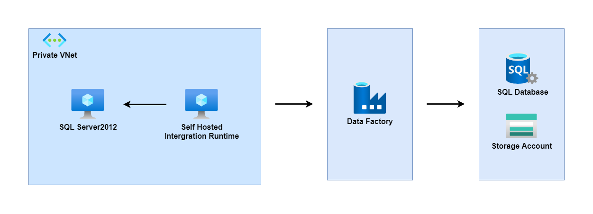

# Copy data from onpremise to Azure SQL database and Azure Storage via DataFactory

## Prerequisite
- Azure Image include SQLServer2012, Self-Hosted Integration Runtime, AdventureWorks sample data
- Terraform workspace
- Azure VPN enterprise application pre-configure with Azure Active Directory(AAD)

## Architecture

## Steps
1. Set Terraform variable `is_self_hosted_ir_setup_finished = false`
2. Create Resources (Terraform Apply)
3. Get primary key from terraform outputs `terraform output self_hosted_ir_primary_authorization_key`
4. Login to Azure Portal and download VPN configuration via [Virtual network gateways] service
5. Login Azure VPN with AAD account and login to Azure VM with predefined username and password
6. Using primary key to configure self-hosted integration runtime
7. Set Terraform variable `is_self_hosted_ir_setup_finished = true`
8. Create Resources (Terraform Apply)
9. Execute copy script in Azure Data Factory
10. Confirm results from storage account and SQL database

## AdventureWorks sample databases
https://learn.microsoft.com/en-us/sql/samples/adventureworks-install-configure?view=sql-server-ver16&tabs=ssms

